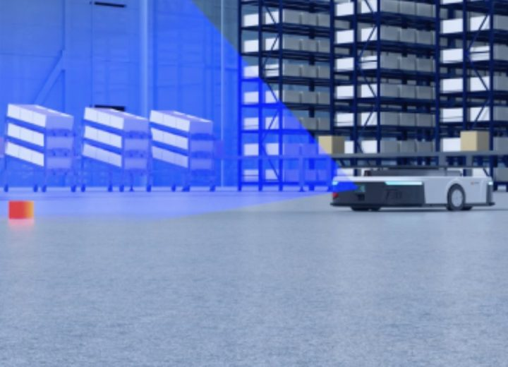
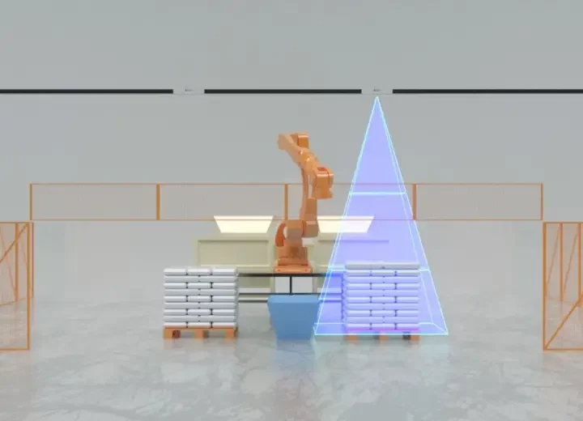
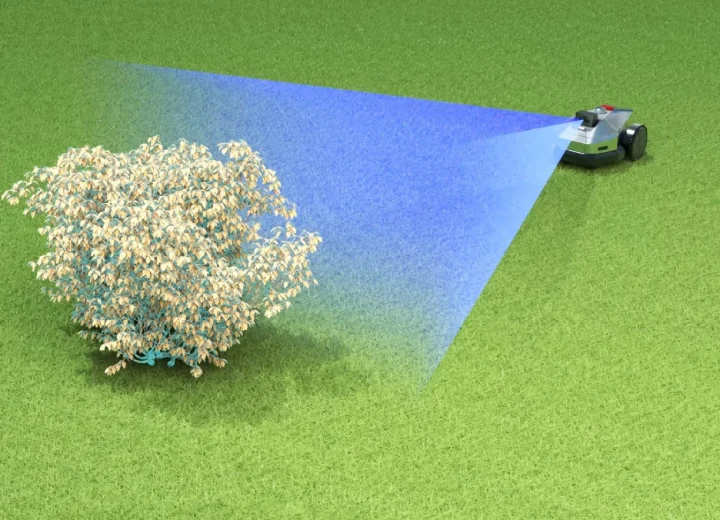
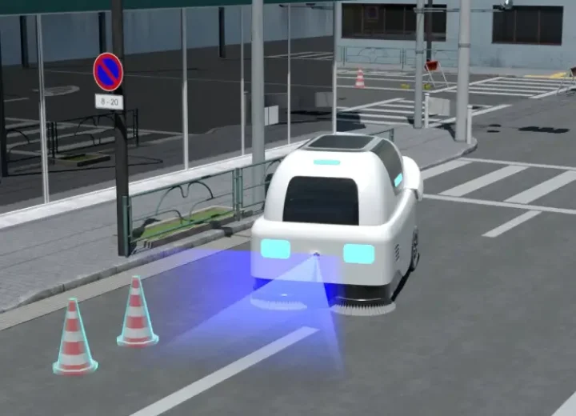
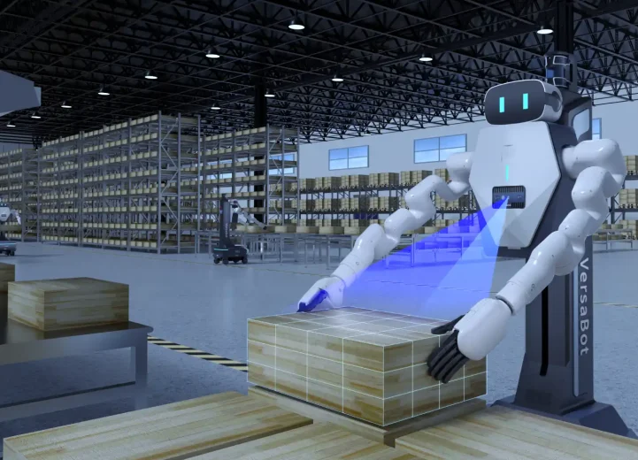
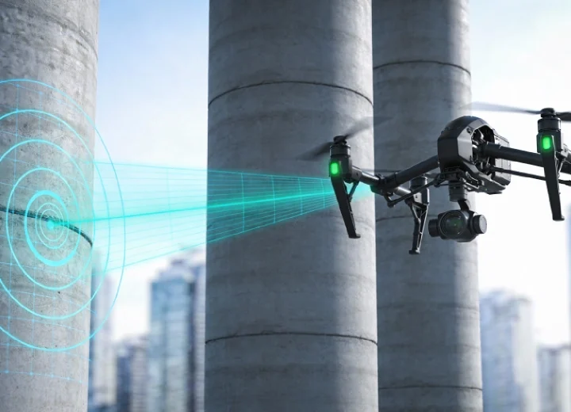

<p align="center">
  
</p>

<h1 align="center">LxCameraSDK</h1>

<p align="center">
  Industrial camera SDK for MRDVS visual hardware products.<br>
  面向迈尔微视视觉硬件产品的工业相机开发套件。
</p>

<p align="center">
  <a href="https://hub.mrdvs.cn/">MRDVS Hub 2.0</a> |
  <a href="#english">English</a> |
  <a href="#中文">中文</a>
</p>

<p align="center">
  
  
  
  
</p>

---

# Table of Contents

- [Table of Contents](#table-of-contents)
- [English](#english)
  - [Overview](#overview)
  - [Product Portfolio](#product-portfolio)
    - [Visual Hardware Products](#visual-hardware-products)
    - [Industrial Solutions](#industrial-solutions)
  - [Documents](#documents)
  - [What This SDK Provides](#what-this-sdk-provides)
  - [Supported Platforms](#supported-platforms)
  - [Package Layout](#package-layout)
  - [Quick Start](#quick-start)
    - [Linux](#linux)
    - [Windows](#windows)
  - [Development Workflow](#development-workflow)
    - [C/C++ API Flow](#cc-api-flow)
    - [Open Modes](#open-modes)
    - [Build Notes](#build-notes)
  - [API Capability Map](#api-capability-map)
  - [Data Outputs](#data-outputs)
    - [Built-In Application Modes](#built-in-application-modes)
  - [Examples](#examples)
    - [C/C++ Samples](#cc-samples)
    - [Python and C# Samples](#python-and-c-samples)
  - [ROS and ROS2 Integration](#ros-and-ros2-integration)
    - [Workspaces](#workspaces)
    - [Main Nodes](#main-nodes)
    - [Camera Topics](#camera-topics)
    - [Camera Services](#camera-services)
    - [Helper Topic Scripts](#helper-topic-scripts)
  - [Runtime Notes](#runtime-notes)
    - [Linux Network and Permissions](#linux-network-and-permissions)
  - [Version](#version)
  - [Support and Contact](#support-and-contact)
- [中文](#中文)
  - [概览](#概览)
  - [产品线简介](#产品线简介)
    - [视觉硬件产品](#视觉硬件产品)
    - [工业解决方案](#工业解决方案)
  - [文档](#文档)
  - [SDK 内容](#sdk-内容)
  - [平台支持](#平台支持)
  - [包结构](#包结构)
  - [快速开始](#快速开始)
    - [Linux](#linux-1)
    - [Windows](#windows-1)
  - [开发流程](#开发流程)
    - [C/C++ API 流程](#cc-api-流程)
    - [打开方式](#打开方式)
    - [构建说明](#构建说明)
  - [API 能力索引](#api-能力索引)
  - [数据输出](#数据输出)
    - [内置应用算法模式](#内置应用算法模式)
  - [示例程序](#示例程序)
    - [C/C++ 示例](#cc-示例)
    - [Python 与 C# 示例](#python-与-c-示例)
  - [ROS 与 ROS2 集成](#ros-与-ros2-集成)
    - [工作空间](#工作空间)
    - [主要节点](#主要节点)
    - [相机话题](#相机话题)
    - [相机服务](#相机服务)
    - [辅助脚本](#辅助脚本)
  - [运行注意事项](#运行注意事项)
    - [Linux 网络与权限](#linux-网络与权限)
  - [版本信息](#版本信息)
  - [支持与联系](#支持与联系)

---

# English

## Overview

LxCameraSDK provides the runtime libraries, C/C++ headers, Python package, C# wrapper samples, and ROS/ROS2 workspaces required to integrate MRDVS camera devices into industrial vision systems.

Typical integration tasks covered by this package include:

- Discovering and opening camera devices by index, IP address, SN, or device ID.
- Starting and stopping data streams.
- Reading RGB, depth, amplitude, full-frame, point-cloud, lidar-point, IMU, and application output data.
- Configuring camera parameters through integer, float, boolean, string, command, pointer, and ROI APIs.
- Running sample flows for single camera, multiple cameras, callback acquisition, pallet positioning, obstacle avoidance, visual localization, lidar-point callbacks, and IMU callbacks.
- Publishing camera data through ROS and ROS2 nodes for robotics systems.

## Product Portfolio

MRDVS is dedicated to helping robots understand the world through 3D vision and AI. Zhejiang MRDVS Technology Co., Ltd. focuses on the development of visual sensors for mobile robots and provides integrated hardware and software solutions that combine 3D vision with AI algorithms. The company's core technical team was established in 2016, and MRDVS is a wholly owned subsidiary of Hangzhou Lanxin Robot Technology Co., Ltd.

MRDVS serves embodied intelligence robots, lawn-mowing robots, commercial cleaning robots, low-speed autonomous vehicles, intelligent wheelchairs, industrial mobile robots, and warehouse logistics automation scenarios. Based on iToF, dToF, binocular structured light, AI algorithms, and multi-sensor fusion, MRDVS continuously iterates visual hardware and algorithm solutions to help robots operate more safely, stably, and intelligently.

For official product information, visit [MRDVS Hub 2.0](https://hub.mrdvs.cn/).

### Visual Hardware Products

| Product line | Description | Typical applications | Image |
| --- | --- | --- | --- |
| S Series dToF LiDAR-Vision Fusion Sensor | Designed for complex indoor and outdoor environments, the S Series combines solid-state LiDAR and visual perception. It supports high-precision ranging, semantic obstacle avoidance, and SLAM mapping, with a maximum ranging distance of 42 m and a maximum field of view of 140 degrees. | Mobile robot SLAM, semantic obstacle avoidance, indoor and outdoor environment perception |  |
| M Series ToF Depth Camera | An RGB-D depth camera based on Sony iToF chips. It is optimized for working distances up to 5 m and adapts to different lighting conditions, object textures, and real-time detection requirements. | Pallet recognition, bin stacking, volume measurement, robotic arm visual guidance, depalletizing and grasping |  |
| V Series Visual Navigation Camera | A full-stack embedded positioning system that fuses 2D LiDAR, vision, and IMU. It provides stable and continuous localization data without relying on external preset markers. | Indoor unmanned forklifts, commercial cleaning robots, digital retrofit of traditional manual forklifts, warehouse localization |  |
| H Series High-Precision Structured-Light Camera | A high-precision 3D camera based on binocular coded structured light, designed for high-precision recognition, grasping, and real-time 3D feedback. | Automated production, logistics sorting, robotic operation, high-precision recognition and grasping |  |

### Industrial Solutions

| Solution | Description | Image |
| --- | --- | --- |
| Industrial Mobile Robot Visual Perception | Designed for industrial mobile robot scenarios, this solution provides an integrated 3D vision hardware and software system, supporting autonomous localization, intelligent obstacle avoidance, pallet recognition, and bin stacking. |  |
| Warehouse Logistics Automation Vision | Designed for warehouse sensing systems, this solution provides comprehensive 3D perception capabilities, supporting automated warehouse safety monitoring, personnel safety protection, cargo volume measurement, and storage location status detection to improve warehouse logistics management efficiency. |  |
| Intelligent Lawn-Mowing Robot Perception | Integrating solid-state LiDAR and visual perception, this solution supports surrounding perception, low-obstacle detection, centimeter-level mapping, real-time localization, and safe path planning, improving reliability in complex lawn environments. |  |
| Outdoor Low-Speed Autonomous Vehicle Perception | Designed for outdoor low-speed autonomous vehicles, this solution provides RGB-D perception with strong anti-interference capability, supporting wide-field coverage, low-latency point cloud output, and high-precision spatiotemporal synchronization. |  |
| Humanoid and Quadruped Robot Perception | Designed for humanoid and quadruped robots, this solution provides panoramic perception, close-range obstacle avoidance, dynamic gait adaptation, 3D terrain modeling, and obstacle recognition, enhancing flexible interaction and environmental understanding in complex scenarios. |  |
| UAV Full-Scenario Visual Perception | Based on a multimodal perception architecture integrating solid-state LiDAR, vision cameras, and IMU, this solution supports high-precision mapping and localization, full-scenario 3D perception, semantic object recognition, and safe obstacle avoidance, improving UAV flight safety and stability. |  |


## Documents


- LxCameraSDK C/C++ Developer Guide [Click here](https://github.com/Lanxin-MRDVS/CameraSDK/blob/master/Document_EN/MRDVS_LxCameraSDK_C-Cpp_DeveloperGuide_V1.0_20260604.pdf)
- LxCameraSDK Python Developer Guide [Click here](https://github.com/Lanxin-MRDVS/CameraSDK/blob/master/Document_EN/LxCameraSDK-Python%20User%20Manual_EN.PDF)
- LxCameraViewer User Manual [Click here](https://github.com/Lanxin-MRDVS/CameraSDK/blob/master/Document_EN/LxCameraViewer%20User%20Manual.pdf)


## What This SDK Provides

| Area | Included content |
| --- | --- |
| Native SDK | Headers, dynamic libraries, import libraries, and runtime dependencies for Linux and Windows. |
| C/C++ development | Public API declarations in `lx_camera_api.h`, shared type definitions in `lx_camera_define.h`, application algorithm structures in `lx_camera_application.h`, and CMake-based samples. |
| Python development | Python wheel package and demo script under both Linux and Windows sample folders. |
| C# development | C# wrapper source, generated wrapper DLL, demo source files, and CMake project under the Windows sample folder. |
| Robotics integration | ROS and ROS2 workspaces, custom messages, custom services, launch files, RViz configurations, and camera/localization nodes. |
| Runtime setup | Linux installation script, socket buffer configuration script, and firewall helper script. |

## Supported Platforms

| Platform | Architectures in package | Runtime libraries | Samples |
| --- | --- | --- | --- |
| Linux | `linux_x64`, `linux_aarch64`, `linux_arm32` | `libLxCameraApi.so`, `libLxDataProcess.so` | C/C++, Python, ROS, ROS2 |
| Windows | `win_x64`, `win_x86` | `LxCameraApi.dll`, `LxCameraApi.lib`, `LxDataProcess.dll` | C/C++, C#, Python |

## Package Layout

```text
CameraSDK-master/
├── linux/
│   ├── install.sh
│   ├── set_socket_buffer_size.sh
│   ├── set_firewall.sh
│   ├── SDK/
│   │   ├── include/
│   │   │   ├── lx_camera_api.h
│   │   │   ├── lx_camera_api_version.h
│   │   │   ├── lx_camera_application.h
│   │   │   └── lx_camera_define.h
│   │   └── lib/
│   │       ├── linux_x64/
│   │       ├── linux_aarch64/
│   │       └── linux_arm32/
│   └── Sample/
│       ├── C/
│       ├── python/
│       ├── ROS/
│       └── ROS2/
├── windows/
│   ├── SDK/
│   │   ├── include/
│   │   └── lib/
│   │       ├── win_x64/
│   │       └── win_x86/
│   └── Sample/
│       ├── C/
│       ├── C#/
│       └── python/
├── README.md
└── release_note.txt
```

## Quick Start

### Linux

Install the SDK runtime files and configure the shared-library path:

```bash
cd linux
source install.sh
```

The script deploys headers and libraries to `/opt/MRDVS`, updates the shell library path, and runs the socket buffer helper. It may require root or sudo permission.

Build the C/C++ samples:

```bash
cd linux/Sample/C
mkdir build
cd build
cmake ..
make
```

Install and run the Python sample:

```bash
cd linux/Sample/python
pip install lx_camera_py-1.3.3-py3-none-any.whl
python demo.py
```

Before running the Python sample, replace the sample SDK library path and camera IP with your local environment values.

### Windows

Build the C/C++ samples:

```powershell
cd windows\Sample\C
mkdir build
cd build
cmake ..
cmake --build . --config Release
```

Install and run the Python sample:

```powershell
cd windows\Sample\python
pip install .\lx_camera_py-1.3.3-py3-none-any.whl
python .\demo.py
```

Build or inspect the C# sample project:

```powershell
cd windows\Sample\C#
```

At runtime, make sure the matching DLL directory is available to the application:

- `windows/SDK/lib/win_x64`
- `windows/SDK/lib/win_x86`

## Development Workflow

### C/C++ API Flow

The minimal native integration flow is:

```cpp
#include "lx_camera_api.h"

LxDeviceInfo* device_list = nullptr;
int device_count = 0;
DcHandle handle = 0;
LxDeviceInfo device_info = {};

DcGetDeviceList(&device_list, &device_count);
DcOpenDevice(OPEN_BY_IP, "<CAMERA_IP>", &handle, &device_info);

DcSetBoolValue(handle, LX_BOOL_ENABLE_3D_DEPTH_STREAM, true);
DcSetBoolValue(handle, LX_BOOL_ENABLE_3D_AMP_STREAM, true);
DcSetBoolValue(handle, LX_BOOL_ENABLE_2D_STREAM, true);

DcStartStream(handle);
DcSetCmd(handle, LX_CMD_GET_NEW_FRAME);

void* frame_ptr = nullptr;
DcGetPtrValue(handle, LX_PTR_FRAME_DATA, &frame_ptr);
FrameInfo* frame = static_cast<FrameInfo*>(frame_ptr);

DcStopStream(handle);
DcCloseDevice(handle);
```

For callback-based acquisition, register `DcRegisterFrameCallback` before starting the stream. In callback mode, the frame callback receives `FrameInfo*`, and the sample code does not need an additional `LX_CMD_GET_NEW_FRAME` call inside the callback path.

### Open Modes

| Mode | Parameter |
| --- | --- |
| `OPEN_BY_INDEX` | Device index in the discovered list. |
| `OPEN_BY_IP` | Camera IP address or `ip:port`. |
| `OPEN_BY_SN` | Camera SN. |
| `OPEN_BY_ID` | Camera ID. |

### Build Notes

| Area | Notes from package files |
| --- | --- |
| C/C++ samples | CMake minimum version is `3.0`; samples use C++11. OpenCV is searched by CMake and used by visualization-related examples. |
| Linux SDK install | The install script copies SDK files to `/opt/MRDVS` and selects libraries by `uname -m`. |
| ROS sample | Uses catkin, C++14, OpenCV, PCL, `roscpp`, `sensor_msgs`, `geometry_msgs`, `image_transport`, `tf`, and custom messages/services. |
| ROS2 sample | Uses CMake `3.10`, C++14, ament, OpenMP, OpenCV, PCL, `rclcpp`, `sensor_msgs`, `geometry_msgs`, `nav_msgs`, `image_transport`, `tf2`, `tf2_ros`, and custom messages/services. |
| Python sample | Imports `cv2`, `numpy`, and `LxCameraSDK`. The sample contains local SDK library path and camera IP values that should be edited before use. |
| C# sample | `LxCameraApi.cs` wraps `LxCameraApi.dll`; `LxCameraApiNet.dll` is loaded by the demo project. |

## API Capability Map

| Capability | Main API or type |
| --- | --- |
| Version and errors | `DcGetApiVersion`, `DcGetErrorString` |
| Logging | `DcSetInfoOutput`, `DcLog`, `DcSetMaxLogFile`, `DcSetMaxLogFileSize` |
| Device discovery | `DcGetDeviceList`, `LxDeviceInfo` |
| Device lifecycle | `DcOpenDevice`, `DcCloseDevice`, `DcStartStream`, `DcStopStream` |
| Device network | `DcSetCameraIp` |
| Parameter read/write | `DcSetIntValue`, `DcGetIntValue`, `DcSetFloatValue`, `DcGetFloatValue`, `DcSetBoolValue`, `DcGetBoolValue`, `DcSetStringValue`, `DcGetStringValue` |
| Commands and pointer data | `DcSetCmd`, `DcGetPtrValue` |
| ROI | `DcSetROI` |
| Special controls | `DcSpecialControl`, `DcSpecialControlExtend` |
| Frame callback | `DcRegisterFrameCallback`, `DcUnregisterFrameCallback`, `LX_FRAME_CALLBACK` |
| Camera status callback | `DcRegisterCameraStatusCallback`, `DcUnregisterCameraStatusCallback`, `LX_CAMERA_STATUS_CALLBACK` |
| IMU callback | `DcRegisterImuDataCallback`, `DcUnregisterImuDataCallback`, `LX_IMUDATA_CALLBACK` |
| User data | `DcWriteUserData`, `DcReadUserData` |
| Point cloud export | `DcSaveXYZ` |
| Runtime tuning | `DcSetGpuEnable`, `DcGetGpuEnable`, `DcSetPtpEnable`, `DcGetPtpEnable`, `DcSetParallelThread`, `DcSetJpegDecodeMethod` |

## Data Outputs

| Output | Related source definition or feature |
| --- | --- |
| Full frame | `FrameInfo`, `LX_PTR_FRAME_DATA` |
| Depth image | `FrameInfo.depth_data`, `LX_BOOL_ENABLE_3D_DEPTH_STREAM`, `LX_PTR_3D_DEPTH_DATA` |
| Amplitude image | `FrameInfo.amp_data`, `LX_BOOL_ENABLE_3D_AMP_STREAM`, `LX_PTR_3D_AMP_DATA` |
| RGB image | `FrameInfo.rgb_data`, `LX_BOOL_ENABLE_2D_STREAM`, `LX_PTR_2D_IMAGE_DATA` |
| Application output | `FrameInfo.app_data`, `LX_INT_ALGORITHM_MODE`, `LX_PTR_ALGORITHM_OUTPUT` |
| XYZ point cloud | `LX_PTR_XYZ_DATA` |
| XYZIRT lidar-point cloud | `LX_PTR_XYZIRT_DATA`, `LxPointCloudData` |
| IMU data | `LX_BOOL_ENABLE_IMU`, `LxImuData`, `DcRegisterImuDataCallback` |
| Intrinsic and extrinsic parameters | `LX_PTR_2D_INTRINSIC_PARAMETERS`, `LX_PTR_3D_INTRINSIC_PARAMETERS`, `LX_PTR_3D_EXTRIC_PARAM`, `LX_PTR_IMU_EXTRIC_PARAM` |
| Frame extension | `FrameExtendInfo` with depth, amplitude, RGB, and application frame IDs |

### Built-In Application Modes

| Mode | Purpose |
| --- | --- |
| `MODE_ALL_OFF` | Disable built-in application algorithm. |
| `MODE_AVOID_OBSTACLE` | Obstacle avoidance algorithm. |
| `MODE_PALLET_LOCATE` | Pallet positioning algorithm. |
| `MODE_VISION_LOCATION` | Visual localization algorithm. |
| `MODE_AVOID_OBSTACLE2` | Obstacle avoidance algorithm V2. |
| `MODE_GENERIC_DATA` | Custom application data type. |

## Examples

### C/C++ Samples

| Sample | Linux | Windows | Purpose |
| --- | --- | --- | --- |
| [`single_camera2`](./linux/Sample/C/single_camera2/) | Yes | Yes | Open one camera and acquire frame data. |
| [`multi_cameras`](./linux/Sample/C/multi_cameras/) | Yes | Yes | Open multiple cameras and acquire stream data. |
| [`frame_callback`](./linux/Sample/C/frame_callback/) | Yes | Yes | Acquire frames through callback registration. |
| [`application_obstacle_v1`](./linux/Sample/C/application_obstacle_v1/) | Yes | Yes | Enable obstacle avoidance mode and read obstacle output. |
| [`application_obstacle_v2`](./linux/Sample/C/application_obstacle_v2/) | Yes | Yes | Enable obstacle avoidance V2 mode and read obstacle output. |
| [`application_pallet`](./linux/Sample/C/application_pallet/) | Yes | Yes | Enable pallet positioning mode and read pallet pose output. |
| [`application_location`](./linux/Sample/C/application_location/) | Yes | Yes | Enable visual localization mode and read localization output. |
| [`imu_callback`](./linux/Sample/C/imu_callback/) | Yes | Yes | Receive IMU data through callback logic. |
| [`lidarpoint_callback`](./linux/Sample/C/lidarpoint_callback/) | Yes | Yes | Receive lidar-point data and process point output. |
| [`arm_local_camera`](./linux/Sample/C/arm_local_camera/) | Yes | No | Call the SDK from the camera ARM-side environment. |

Windows C/C++ counterparts are under [`windows/Sample/C`](./windows/Sample/C/).

### Python and C# Samples

| Sample type | Path | Notes |
| --- | --- | --- |
| Python | [`linux/Sample/python`](./linux/Sample/python/), [`windows/Sample/python`](./windows/Sample/python/) | Demonstrates device list, open, stream enable, frame acquisition, depth/amplitude/RGB visualization, point cloud access, and frame-rate statistics. |
| C# | [`windows/Sample/C%23`](./windows/Sample/C%23/) | Demonstrates wrapper usage through `LxCameraApiNet.dll`, device open, stream control, pointer data, pallet output, and obstacle output. |

## ROS and ROS2 Integration

### Workspaces

| Framework | Workspace | Build command |
| --- | --- | --- |
| ROS | [`linux/Sample/ROS/lx_camera_node_ws`](./linux/Sample/ROS/lx_camera_node_ws/) | `./build.sh` or `catkin_make` |
| ROS2 | [`linux/Sample/ROS2/lx_camera_node_ws`](./linux/Sample/ROS2/lx_camera_node_ws/) | `./build.sh` or `colcon build` |

### Main Nodes

| Framework | Node | Purpose |
| --- | --- | --- |
| ROS | `lx_camera_node` | Publishes camera image, depth, amplitude, point cloud, IMU, frame-rate, pallet, obstacle, and error data. |
| ROS | `lx_localization_node` | Publishes localization-related RGB and pose output and handles mapping/localization commands. |
| ROS | `sensor_sim_node` | Publishes simulated scan, odometry, and laser pose topics for localization tests. |
| ROS2 | `lx_camera_node` | ROS2 equivalent camera node with custom messages and services. |
| ROS2 | `lx_localization_node` | ROS2 localization node. |
| ROS2 | `sensor_sim_node` | ROS2 simulation node. |

### Camera Topics

| Topic | Message type / content |
| --- | --- |
| `LxCamera_Rgb` | RGB image |
| `LxCamera_RgbInfo` | RGB camera info |
| `LxCamera_Amp` | Amplitude image |
| `LxCamera_Depth` | Depth image |
| `LxCamera_TofInfo` | ToF camera info |
| `LxCamera_Cloud` | Point cloud |
| `LxCamera_LidarCloud` | Lidar-point cloud |
| `LxCamera_Imu` | IMU data |
| `LxCamera_TF` | Transform output |
| `LxCamera_FrameRate` | Frame-rate information |
| `LxCamera_Pallet` | Pallet output |
| `LxCamera_Obstacle` | Obstacle output |
| `LxCamera_Error` | Error message |

### Camera Services

| Service | Purpose |
| --- | --- |
| `LxCamera_LxCmd` | Command API wrapper. |
| `LxCamera_LxInt` | Integer parameter API wrapper. |
| `LxCamera_LxBool` | Boolean parameter API wrapper. |
| `LxCamera_LxFloat` | Float parameter API wrapper. |
| `LxCamera_LxString` | String parameter API wrapper. |

### Helper Topic Scripts

| Script | Framework | Action |
| --- | --- | --- |
| `pallet.sh` | ROS / ROS2 | Echo pallet output topic. |
| `obstacle.sh` | ROS / ROS2 | Echo obstacle output topic. |
| `rate.sh` | ROS / ROS2 | Echo frame-rate topic. |

## Runtime Notes

### Linux Network and Permissions

- `linux/install.sh` copies the SDK to `/opt/MRDVS`, writes runtime library path configuration, and selects libraries for the current architecture.
- `linux/set_socket_buffer_size.sh` sets Linux socket send and receive buffer sizes. The default is 10 MB; accepted arguments include `10`, `15`, `20`, and `25`.
- `linux/set_firewall.sh` contains firewall helper logic for `ufw`, `firewalld`, and `iptables`. The script references UDP ports `9700`, `9800`, `3956`, `3959`, `31900`, `32000`, `39560` and TCP port `9900`.
- If a program exits without calling `DcCloseDevice`, the camera may remain exclusively controlled until heartbeat timeout releases the device.

## Version

| Item | Value |
| --- | --- |
| SDK release | `2.4.60.260126` |
| API macro | `V2.4.60,20260126` |
| Python wheel | `lx_camera_py-1.3.3-py3-none-any.whl` |
| ROS package version | `1.0.0` |
| ROS2 package version | `1.0.0` |

## Support and Contact

- Product knowledge base: [MRDVS Hub 2.0](https://hub.mrdvs.cn/)
- GitHub repository: [Lanxin-MRDVS/CameraSDK](https://github.com/Lanxin-MRDVS/CameraSDK)
- Issue feedback: [GitHub Issues](https://github.com/Lanxin-MRDVS/CameraSDK/issues)
- Product consultation: `+86 400-025-6680`

---

# 中文

## 概览

LxCameraSDK 为迈尔微视相机设备接入工业视觉系统提供运行库、C/C++ 头文件、Python 包、C# 封装示例，以及 ROS/ROS2 工作空间。

本 SDK 覆盖的典型集成任务包括：

- 按索引、IP、SN 或设备 ID 搜索并打开相机设备。
- 启动和停止数据流。
- 获取 RGB、深度、强度、完整帧、点云、激光点、IMU 和应用算法输出数据。
- 通过整型、浮点、布尔、字符串、命令、指针和 ROI 接口配置相机参数。
- 运行单相机、多相机、回调取流、托盘定位、视觉避障、视觉定位、激光点回调和 IMU 回调等示例。
- 通过 ROS 和 ROS2 节点发布相机数据，接入机器人系统。

## 产品线简介

迈尔微视致力于让机器人“看懂”世界，专注移动机器人视觉传感器研发，提供 3D 视觉与 AI 算法相结合的软硬件一体化解决方案。浙江迈尔微视科技有限公司核心技术团队组建于 2016 年，是杭州蓝芯机器人技术股份有限公司的全资子公司。

迈尔微视面向具身智能机器人、割草机器人、商用清洁机器人、低速无人车、智能轮椅、工业移动机器人及仓储物流自动化等场景，提供稳定可靠的视觉感知能力。公司依托 iToF、dToF、双目结构光、AI 算法和多传感器融合技术，持续迭代视觉硬件与算法方案，助力机器人运行更安全、更稳定、更智能。

更多官方产品资料请访问 [MRDVS Hub 2.0](https://hub.mrdvs.cn/)。

### 视觉硬件产品


| 产品线 | 简介 | 典型应用 | 图片 |
| --- | --- | --- | --- |
| S 系列 dToF 雷视融合传感器 | 面向室内外复杂环境设计，融合固态激光雷达与视觉感知能力，支持高精度测距、语义避障和 SLAM 建图，最大测距 42 m，最大视场角 140°。 | 移动机器人 SLAM、语义避障、室内外环境感知 |  |
| M 系列 ToF 深度相机 | 基于 Sony iToF 芯片开发的 RGB-D 深度相机，面向最长 5 m 工作距离优化，可适应不同光照、纹理和实时检测需求。 | 托盘识别、料笼堆叠、体积测量、机械臂视觉引导、拆垛抓取 |  |
| V 系列视觉导航相机 | 融合 2D 激光雷达、视觉与 IMU 的全栈式嵌入式定位系统，不依赖外部预设标记即可输出稳定连续的定位数据。 | 室内无人叉车、商用清洁机器人、传统人工叉车数字化改造、仓储定位 |  |
| H 系列高精度结构光相机 | 基于双目编码结构光技术，面向高精度识别、抓取和实时三维反馈任务设计。 | 自动化生产、物流分拣、机器人操作、高精度识别与抓取 |  |


### 工业解决方案

| 解决方案 | 简介 | 图片 |
| --- | --- | --- |
| 工业移动机器人视觉感知 | 面向工业移动机器人场景，提供基于 3D 视觉感知的软硬件一体化方案，支持自主定位、智能避障、托盘识别与料笼堆叠等核心任务。 |  |
| 仓储物流自动化视觉 | 面向仓储感知系统场景，提供全面的三维感知方案，支持立库安全监控、人体安全防护、货物体积测量和库位状态检测，提升仓储物流管理效率。 |  |
| 智能割草机器人感知 | 融合全固态激光雷达与视觉感知能力，支持车体周边感知、低矮障碍物检测、厘米级建图、实时定位和安全路径规划，提升割草机器人在复杂草坪环境中的可靠性。 |  |
| 室外低速无人车感知 | 面向室外低速无人车场景，提供抗多机、抗多径和抗强光干扰的 RGB-D 感知能力，支持大视场覆盖、低延时点云输出和高精度时空同步。 |  |
| 人形与四足机器人感知 | 面向人形和四足机器人，提供全景感知、近端避障、动态步态适配、地形三维建模和障碍目标识别能力，增强机器人在复杂场景中的灵活交互与环境理解能力。 |  |
| 无人机全域视觉感知 | 采用纯固态激光雷达、视觉相机与 IMU 的多模态融合感知架构，支持高精度建图定位、全场景三维感知、语义级目标识别和安全避障，提升无人机飞行安全性与稳定性。 |  |

## 文档

- LxCameraSDK C/C++ 开发指南 [Click here](https://github.com/Lanxin-MRDVS/CameraSDK/blob/master/Document_CN/MRDVS_LxCameraSDK_C-Cpp_%E5%BC%80%E5%8F%91%E6%8C%87%E5%8D%97_V1.0_20260604.pdf) 
- LxCameraSDK Python 开发指南 [Click here](https://github.com/Lanxin-MRDVS/CameraSDK/blob/master/Document_CN/python%E5%BC%80%E5%8F%91%E6%8C%87%E5%8D%97.pdf)
- LxCameraSDK Linux 示例说明 [Click here](https://github.com/Lanxin-MRDVS/CameraSDK/blob/master/Document_CN/Linux%20%E7%A4%BA%E4%BE%8B%E7%A8%8B%E5%BA%8F%E4%BD%BF%E7%94%A8%E8%AF%B4%E6%98%8E.pdf) 
- LxCameraSDK 设备二次开发常见问题 [Click here](https://github.com/Lanxin-MRDVS/CameraSDK/blob/master/Document_CN/Camera%20%E8%AE%BE%E5%A4%87%E4%BA%8C%E6%AC%A1%E5%BC%80%E5%8F%91%E5%B8%B8%E8%A7%81%E9%97%AE%E9%A2%98%E8%AF%B4%E6%98%8E.pdf)
- LxCameraViewer 用户手册 [Click here](https://github.com/Lanxin-MRDVS/CameraSDK/blob/master/Document_CN/LxCameraViewer%E4%BD%BF%E7%94%A8%E8%AF%B4%E6%98%8E%E4%B9%A6.pdf)

## SDK 内容

| 模块 | 包含内容 |
| --- | --- |
| 原生 SDK | Linux 和 Windows 平台头文件、动态库、导入库和运行依赖。 |
| C/C++ 开发 | `lx_camera_api.h` 中的公开 API、`lx_camera_define.h` 中的通用类型、`lx_camera_application.h` 中的应用算法结构体，以及 CMake 示例。 |
| Python 开发 | Linux 和 Windows 示例目录中的 Python wheel 包和 demo 脚本。 |
| C# 开发 | Windows 示例目录中的 C# 封装源码、封装 DLL、demo 源码和 CMake 工程。 |
| 机器人集成 | ROS 和 ROS2 工作空间、自定义消息、自定义服务、launch 文件、RViz 配置、相机节点和定位节点。 |
| 运行环境配置 | Linux 安装脚本、socket buffer 配置脚本、防火墙辅助脚本。 |

## 平台支持

| 平台 | 包内架构 | 运行库 | 示例 |
| --- | --- | --- | --- |
| Linux | `linux_x64`, `linux_aarch64`, `linux_arm32` | `libLxCameraApi.so`, `libLxDataProcess.so` | C/C++、Python、ROS、ROS2 |
| Windows | `win_x64`, `win_x86` | `LxCameraApi.dll`, `LxCameraApi.lib`, `LxDataProcess.dll` | C/C++、C#、Python |

## 包结构

```text
CameraSDK-master/
├── linux/
│   ├── install.sh
│   ├── set_socket_buffer_size.sh
│   ├── set_firewall.sh
│   ├── SDK/
│   │   ├── include/
│   │   │   ├── lx_camera_api.h
│   │   │   ├── lx_camera_api_version.h
│   │   │   ├── lx_camera_application.h
│   │   │   └── lx_camera_define.h
│   │   └── lib/
│   │       ├── linux_x64/
│   │       ├── linux_aarch64/
│   │       └── linux_arm32/
│   └── Sample/
│       ├── C/
│       ├── python/
│       ├── ROS/
│       └── ROS2/
├── windows/
│   ├── SDK/
│   │   ├── include/
│   │   └── lib/
│   │       ├── win_x64/
│   │       └── win_x86/
│   └── Sample/
│       ├── C/
│       ├── C#/
│       └── python/
├── README.md
└── release_note.txt
```

## 快速开始

### Linux

安装 SDK 运行文件并配置动态库路径：

```bash
cd linux
source install.sh
```

该脚本会将头文件和库文件部署到 `/opt/MRDVS`，更新 shell 动态库路径，并执行 socket buffer 配置。执行时可能需要 root 或 sudo 权限。

编译 C/C++ 示例：

```bash
cd linux/Sample/C
mkdir build
cd build
cmake ..
make
```

安装并运行 Python 示例：

```bash
cd linux/Sample/python
pip install lx_camera_py-1.3.3-py3-none-any.whl
python demo.py
```

运行 Python 示例前，请将示例中的 SDK 库路径和相机 IP 替换为本机环境值。

### Windows

编译 C/C++ 示例：

```powershell
cd windows\Sample\C
mkdir build
cd build
cmake ..
cmake --build . --config Release
```

安装并运行 Python 示例：

```powershell
cd windows\Sample\python
pip install .\lx_camera_py-1.3.3-py3-none-any.whl
python .\demo.py
```

查看或构建 C# 示例：

```powershell
cd windows\Sample\C#
```

运行 Windows 示例时，请确认对应架构的 DLL 目录可被程序加载：

- `windows/SDK/lib/win_x64`
- `windows/SDK/lib/win_x86`

## 开发流程

### C/C++ API 流程

原生接口的最小集成流程如下：

```cpp
#include "lx_camera_api.h"

LxDeviceInfo* device_list = nullptr;
int device_count = 0;
DcHandle handle = 0;
LxDeviceInfo device_info = {};

DcGetDeviceList(&device_list, &device_count);
DcOpenDevice(OPEN_BY_IP, "<CAMERA_IP>", &handle, &device_info);

DcSetBoolValue(handle, LX_BOOL_ENABLE_3D_DEPTH_STREAM, true);
DcSetBoolValue(handle, LX_BOOL_ENABLE_3D_AMP_STREAM, true);
DcSetBoolValue(handle, LX_BOOL_ENABLE_2D_STREAM, true);

DcStartStream(handle);
DcSetCmd(handle, LX_CMD_GET_NEW_FRAME);

void* frame_ptr = nullptr;
DcGetPtrValue(handle, LX_PTR_FRAME_DATA, &frame_ptr);
FrameInfo* frame = static_cast<FrameInfo*>(frame_ptr);

DcStopStream(handle);
DcCloseDevice(handle);
```

如果使用回调方式取流，请在启流前注册 `DcRegisterFrameCallback`。回调方式下，帧回调会收到 `FrameInfo*`，示例代码不需要在回调路径中额外调用 `LX_CMD_GET_NEW_FRAME`。

### 打开方式

| 模式 | 参数 |
| --- | --- |
| `OPEN_BY_INDEX` | 搜索列表中的设备索引。 |
| `OPEN_BY_IP` | 相机 IP 或 `ip:port`。 |
| `OPEN_BY_SN` | 相机 SN。 |
| `OPEN_BY_ID` | 相机设备 ID。 |

### 构建说明

| 模块 | 来自包内文件的说明 |
| --- | --- |
| C/C++ 示例 | CMake 最低版本为 `3.0`，示例使用 C++11。CMake 会查找 OpenCV，部分可视化相关示例会使用 OpenCV。 |
| Linux SDK 安装 | 安装脚本会复制 SDK 到 `/opt/MRDVS`，并按 `uname -m` 自动选择对应架构库。 |
| ROS 示例 | 使用 catkin、C++14、OpenCV、PCL、`roscpp`、`sensor_msgs`、`geometry_msgs`、`image_transport`、`tf` 和自定义消息/服务。 |
| ROS2 示例 | 使用 CMake `3.10`、C++14、ament、OpenMP、OpenCV、PCL、`rclcpp`、`sensor_msgs`、`geometry_msgs`、`nav_msgs`、`image_transport`、`tf2`、`tf2_ros` 和自定义消息/服务。 |
| Python 示例 | 导入 `cv2`、`numpy` 和 `LxCameraSDK`。示例内的本地 SDK 库路径和相机 IP 需要根据实际环境修改。 |
| C# 示例 | `LxCameraApi.cs` 封装 `LxCameraApi.dll`；demo 工程加载 `LxCameraApiNet.dll`。 |

## API 能力索引

| 能力 | 主要 API 或类型 |
| --- | --- |
| 版本与错误信息 | `DcGetApiVersion`, `DcGetErrorString` |
| 日志 | `DcSetInfoOutput`, `DcLog`, `DcSetMaxLogFile`, `DcSetMaxLogFileSize` |
| 设备搜索 | `DcGetDeviceList`, `LxDeviceInfo` |
| 设备生命周期 | `DcOpenDevice`, `DcCloseDevice`, `DcStartStream`, `DcStopStream` |
| 设备网络配置 | `DcSetCameraIp` |
| 参数读写 | `DcSetIntValue`, `DcGetIntValue`, `DcSetFloatValue`, `DcGetFloatValue`, `DcSetBoolValue`, `DcGetBoolValue`, `DcSetStringValue`, `DcGetStringValue` |
| 命令与指针数据 | `DcSetCmd`, `DcGetPtrValue` |
| ROI | `DcSetROI` |
| 特殊控制 | `DcSpecialControl`, `DcSpecialControlExtend` |
| 帧回调 | `DcRegisterFrameCallback`, `DcUnregisterFrameCallback`, `LX_FRAME_CALLBACK` |
| 相机状态回调 | `DcRegisterCameraStatusCallback`, `DcUnregisterCameraStatusCallback`, `LX_CAMERA_STATUS_CALLBACK` |
| IMU 回调 | `DcRegisterImuDataCallback`, `DcUnregisterImuDataCallback`, `LX_IMUDATA_CALLBACK` |
| 用户数据 | `DcWriteUserData`, `DcReadUserData` |
| 点云导出 | `DcSaveXYZ` |
| 运行调优 | `DcSetGpuEnable`, `DcGetGpuEnable`, `DcSetPtpEnable`, `DcGetPtpEnable`, `DcSetParallelThread`, `DcSetJpegDecodeMethod` |

## 数据输出

| 输出 | 相关定义或功能 |
| --- | --- |
| 完整帧 | `FrameInfo`, `LX_PTR_FRAME_DATA` |
| 深度图 | `FrameInfo.depth_data`, `LX_BOOL_ENABLE_3D_DEPTH_STREAM`, `LX_PTR_3D_DEPTH_DATA` |
| 强度图 | `FrameInfo.amp_data`, `LX_BOOL_ENABLE_3D_AMP_STREAM`, `LX_PTR_3D_AMP_DATA` |
| RGB 图 | `FrameInfo.rgb_data`, `LX_BOOL_ENABLE_2D_STREAM`, `LX_PTR_2D_IMAGE_DATA` |
| 应用算法输出 | `FrameInfo.app_data`, `LX_INT_ALGORITHM_MODE`, `LX_PTR_ALGORITHM_OUTPUT` |
| XYZ 点云 | `LX_PTR_XYZ_DATA` |
| XYZIRT 激光点云 | `LX_PTR_XYZIRT_DATA`, `LxPointCloudData` |
| IMU 数据 | `LX_BOOL_ENABLE_IMU`, `LxImuData`, `DcRegisterImuDataCallback` |
| 内外参 | `LX_PTR_2D_INTRINSIC_PARAMETERS`, `LX_PTR_3D_INTRINSIC_PARAMETERS`, `LX_PTR_3D_EXTRIC_PARAM`, `LX_PTR_IMU_EXTRIC_PARAM` |
| 帧扩展信息 | `FrameExtendInfo`，包含深度、强度、RGB 和应用数据帧 ID |

### 内置应用算法模式

| 模式 | 用途 |
| --- | --- |
| `MODE_ALL_OFF` | 关闭内置应用算法。 |
| `MODE_AVOID_OBSTACLE` | 视觉避障算法。 |
| `MODE_PALLET_LOCATE` | 托盘定位算法。 |
| `MODE_VISION_LOCATION` | 视觉定位算法。 |
| `MODE_AVOID_OBSTACLE2` | 视觉避障算法 V2。 |
| `MODE_GENERIC_DATA` | 自定义应用数据类型。 |

## 示例程序

### C/C++ 示例

| 示例 | Linux | Windows | 作用 |
| --- | --- | --- | --- |
| [`single_camera2`](./linux/Sample/C/single_camera2/) | 支持 | 支持 | 打开单台相机并获取帧数据。 |
| [`multi_cameras`](./linux/Sample/C/multi_cameras/) | 支持 | 支持 | 打开多台相机并获取数据流。 |
| [`frame_callback`](./linux/Sample/C/frame_callback/) | 支持 | 支持 | 通过帧回调注册方式获取数据。 |
| [`application_obstacle_v1`](./linux/Sample/C/application_obstacle_v1/) | 支持 | 支持 | 启用避障模式并读取避障输出。 |
| [`application_obstacle_v2`](./linux/Sample/C/application_obstacle_v2/) | 支持 | 支持 | 启用避障 V2 模式并读取避障输出。 |
| [`application_pallet`](./linux/Sample/C/application_pallet/) | 支持 | 支持 | 启用托盘定位模式并读取托盘位姿输出。 |
| [`application_location`](./linux/Sample/C/application_location/) | 支持 | 支持 | 启用视觉定位模式并读取定位输出。 |
| [`imu_callback`](./linux/Sample/C/imu_callback/) | 支持 | 支持 | 通过回调逻辑接收 IMU 数据。 |
| [`lidarpoint_callback`](./linux/Sample/C/lidarpoint_callback/) | 支持 | 支持 | 接收激光点数据并处理点输出。 |
| [`arm_local_camera`](./linux/Sample/C/arm_local_camera/) | 支持 | 不支持 | 在相机 ARM 侧环境调用 SDK。 |

Windows C/C++ 对应示例位于 [`windows/Sample/C`](./windows/Sample/C/)。

### Python 与 C# 示例

| 示例类型 | 路径 | 说明 |
| --- | --- | --- |
| Python | [`linux/Sample/python`](./linux/Sample/python/), [`windows/Sample/python`](./windows/Sample/python/) | 演示设备搜索、打开、启流、取帧、深度/强度/RGB 可视化、点云访问和帧率统计。 |
| C# | [`windows/Sample/C%23`](./windows/Sample/C%23/) | 演示通过 `LxCameraApiNet.dll` 调用封装接口，完成设备打开、流控制、指针数据、托盘输出和避障输出。 |

## ROS 与 ROS2 集成

### 工作空间

| 框架 | 工作空间 | 构建命令 |
| --- | --- | --- |
| ROS | [`linux/Sample/ROS/lx_camera_node_ws`](./linux/Sample/ROS/lx_camera_node_ws/) | `./build.sh` 或 `catkin_make` |
| ROS2 | [`linux/Sample/ROS2/lx_camera_node_ws`](./linux/Sample/ROS2/lx_camera_node_ws/) | `./build.sh` 或 `colcon build` |

### 主要节点

| 框架 | 节点 | 作用 |
| --- | --- | --- |
| ROS | `lx_camera_node` | 发布相机图像、深度、强度、点云、IMU、帧率、托盘、避障和错误数据。 |
| ROS | `lx_localization_node` | 发布定位相关 RGB 和位姿输出，并处理建图/定位命令。 |
| ROS | `sensor_sim_node` | 发布模拟激光、里程计和激光位姿话题，用于定位测试。 |
| ROS2 | `lx_camera_node` | ROS2 版本相机节点，包含自定义消息和服务。 |
| ROS2 | `lx_localization_node` | ROS2 版本定位节点。 |
| ROS2 | `sensor_sim_node` | ROS2 版本模拟节点。 |

### 相机话题

| 话题 | 消息内容 |
| --- | --- |
| `LxCamera_Rgb` | RGB 图像 |
| `LxCamera_RgbInfo` | RGB 相机信息 |
| `LxCamera_Amp` | 强度图 |
| `LxCamera_Depth` | 深度图 |
| `LxCamera_TofInfo` | ToF 相机信息 |
| `LxCamera_Cloud` | 点云 |
| `LxCamera_LidarCloud` | 激光点云 |
| `LxCamera_Imu` | IMU 数据 |
| `LxCamera_TF` | 坐标变换输出 |
| `LxCamera_FrameRate` | 帧率信息 |
| `LxCamera_Pallet` | 托盘输出 |
| `LxCamera_Obstacle` | 避障输出 |
| `LxCamera_Error` | 错误信息 |

### 相机服务

| 服务 | 作用 |
| --- | --- |
| `LxCamera_LxCmd` | 命令接口封装。 |
| `LxCamera_LxInt` | 整型参数接口封装。 |
| `LxCamera_LxBool` | 布尔参数接口封装。 |
| `LxCamera_LxFloat` | 浮点参数接口封装。 |
| `LxCamera_LxString` | 字符串参数接口封装。 |

### 辅助脚本

| 脚本 | 框架 | 动作 |
| --- | --- | --- |
| `pallet.sh` | ROS / ROS2 | 输出托盘结果话题。 |
| `obstacle.sh` | ROS / ROS2 | 输出避障结果话题。 |
| `rate.sh` | ROS / ROS2 | 输出帧率话题。 |

## 运行注意事项

### Linux 网络与权限

- `linux/install.sh` 会将 SDK 复制到 `/opt/MRDVS`，写入运行库路径，并根据当前架构选择库文件。
- `linux/set_socket_buffer_size.sh` 用于设置 Linux socket 收发缓冲区。默认值为 10 MB，可传入 `10`、`15`、`20`、`25`。
- `linux/set_firewall.sh` 包含针对 `ufw`、`firewalld` 和 `iptables` 的防火墙辅助逻辑。脚本中涉及 UDP 端口 `9700`、`9800`、`3956`、`3959`、`31900`、`32000`、`39560`，以及 TCP 端口 `9900`。
- 如果程序异常退出且没有调用 `DcCloseDevice`，相机可能在心跳超时释放前保持独占控制状态。

## 版本信息

| 项目 | 内容 |
| --- | --- |
| SDK 版本 | `2.4.60.260126` |
| API 宏定义 | `V2.4.60,20260126` |
| Python wheel | `lx_camera_py-1.3.3-py3-none-any.whl` |
| ROS package 版本 | `1.0.0` |
| ROS2 package 版本 | `1.0.0` |

## 支持与联系

- 产品知识库：[MRDVS Hub 2.0](https://hub.mrdvs.cn/)
- GitHub 仓库：[Lanxin-MRDVS/CameraSDK](https://github.com/Lanxin-MRDVS/CameraSDK)
- 问题反馈：[GitHub Issues](https://github.com/Lanxin-MRDVS/CameraSDK/issues)
- 产品咨询：`400-025-6680`
